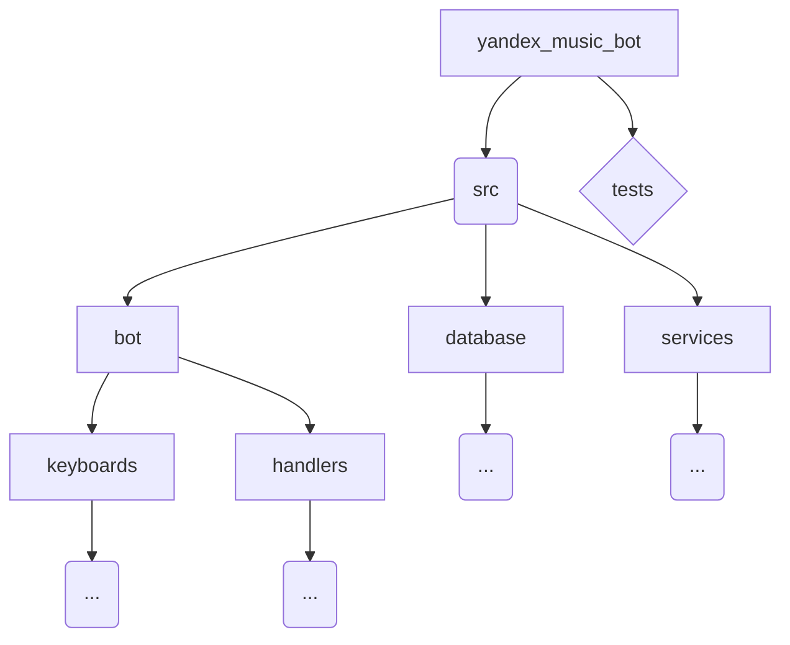
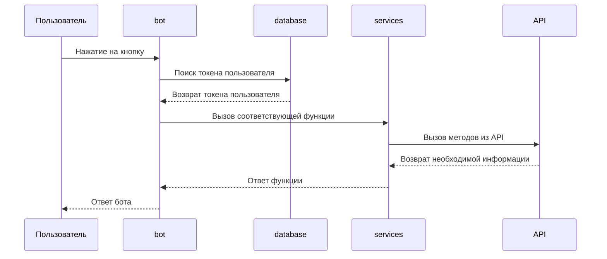

# yandex_music_bot

# Описание
## Этот репозиторий содержит реализацию бота, который позволяет прямо из телеграма:

- Иметь доступ к своим плейлистам из Яндекс Музыки
- Создавать новые плейлисты
- Получить текст песни
- Полчить общую информацию о песне
- Получить информацию об исполнителе
- Получить статистику о прослушиваниях за период
- Добавить трек в плейлист

# Пользовательский интерфейс
После нажатия на кнопку `START` пользователю будет выведена краткая информация, описывающая возможности бота, а так же будет предложено авторизоваться. После авторизации появится `Главное меню` с кнопками:
- `Плейлисты`
- `Создать плейлист`
- `Лайкнуть трек`
- `Текст песни` 
- `Добавить треки`
- `Статистика`
- `Помощь`

## Функционал кнопок
### Плейлисты
Пользовтелю выводятся названия плейлистов, их автор, а также количество треков в каждом из плейлистов

### Создать плейлист
Пользователю предлагается написать имя для создания нового плейлиста, после чего он появится на аккаунте

### Лайкнуть трек
Пользователю предлагается ввести название трека, после чего, если в Яндекс Музыке такой трек есть, его добавят в _любимые_

### Добавить треки
Эта кнопка позволяет добавить трек в один из плейлистов пользователя:
- Первым делом необходимо написать **название плейлиста**, в который трек будет добавлен
- Если плейлиста нет, то он будет создан
- После чего нужно ввести название добавляемого трека
- Done

### Статистика
После сбора информации о пользователе, который сопровождается комментарием `📊 Собираю статистику...` бот высвечивает:
- Количество **лайкнутых треков**
- Количество **лайков за последний месяц**
- Топ **артистов** из треков в _понравившихся_
- Топ **жанров**

### Помощь
По нажатии на кнопку будет выведено краткое описание каждой функции бота, а так же представлен перечень команд, которые находятся в `Menu` или могут быть введены вручную:
- `/start` - Выход на начальное сообщение
- `/auth` - Авторизация
- `/logout` - Выход из аккаунта
- `/help` - Текущее сообщение

###
Примечание: после перехода по любой из кнопок появится ещё одна -- кнопка возврата в `Главное меню`

# Общая структура проекта:

В директории `database` и `services` лежат реализации базы данных и взаимодействием с `yandex-music-api` соответственно. В `bot` лежат директории обработчиков команд и клавиатур. `handlers` свзятывает кнопки бота с реализациями функций из `services`, а так же добавляет пользователей в базу данных после успешной OAuth авторизации. Отдельно находится директория `tests` в которой находятся все тесты.

## Реализация

## Детали

### bot

Для написания бота был использован фреймворк `aiogram`

### database

Для создания базы данных используется `SQLAlchemy`

Потребовалась одна таблица - `user_tokens`, хранящая токены пользователей. Она соответствует паттерну CRUD и имеет такие функции:
- `get_token`
- `set_token`
- `has_token`
- `remove_token`

### services

В модуле `services` применён ООП подход для большей читабельности кода.
Все описанные выше функции бота содержатся в классе `YandexMusicService`, но т.к. каждая функция комплексно взаимодействует с API, а некоторые куски кода могут повторяться, то было решено написать отдельно 2 миксина (что задействует принцип DRY):
- helpers_mixin - содержит все вспомогательные protected методы
- stats_mixin - содержит все вспомогательные методы для получения статистики пользователя

### tests

Директория `tests` разделена на две меньшие директории: `mixin_tests` и `music_service_tests`. В них происходят unit-тесты методов из модуля `services`.

# Ход работы

## Неделя 1
- Проектирование конечного автомата бота
- Реализация OAuth авторизации через бота
- Реализация функций:
    1. Доступ к своим плейлистам
    2. Получение текста песни
- Работа с Docker, .gitignore

## Неделя 2
- Создание базы данных
- Реализация функций:
    1. Создание нового плейлиста
    2. Получение статистики за период
- Внедрение функций в UI
- Тестирование

## Неделя 3
- Шифрование данных пользователя
- Реализация функций:
    1. Получение информации о песне
    2. Получение информации об исполнителе
    3. Добавление трека в плейлист
- Внедрение функций в UI
- Тестирование

## Неделя 4
- Завершение работы над UI бота
- Тестирование

## Распределение задач
- _TL_ - Архитектура проекта, тестирование, Docker
- _Dev 2_ - Взаимодействие с API, реализация основных функций
- _Dev 3_ - База данных, шифрование личных данных
- _Dev 4_ - Интерфейс, реализация команд бота
